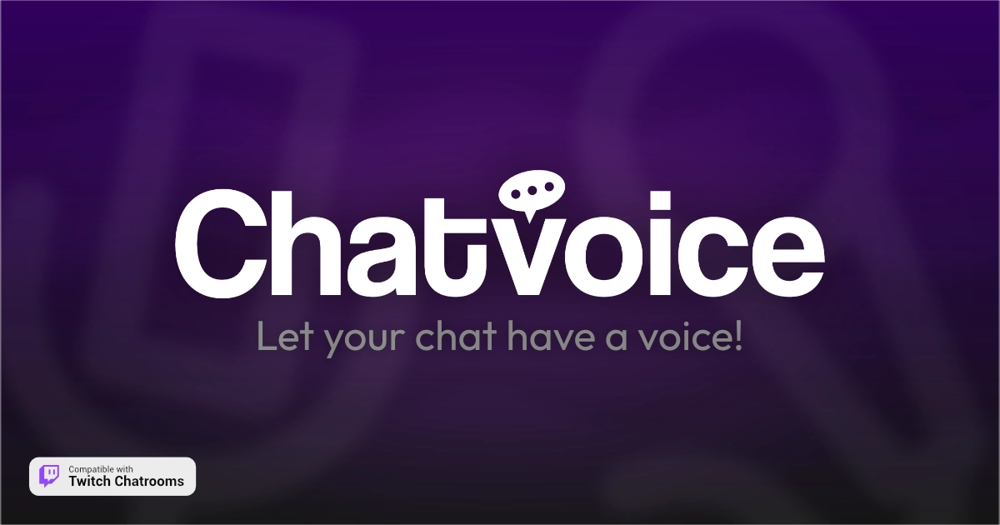

<div align="center">


# Chatvoice
Let your chat have a voice! Read Twitch chat messages aloud using your browser's built-in speech synthesis capabilities.

</div>

## About this repo.

This is the source code for my project that enables Twitch chat messages to be read aloud using the [Speech Synthesis API](https://developer.mozilla.org/en-US/docs/Web/API/SpeechSynthesis) provided by most modern web browsers. Intended to be my own replacement for [Speechchat](https://speechchat.com).

Chatvoice is very customizable, and works in chats of any size, **big or small**! You can assign voices to different chatters to help quickly tell who's talking without looking away at your game or activity. Or you could have voices be completely random, you could make it so that only subscriber's messages are read out loud. There are so many possibilities.

And the best part is, there's no account login or signup required. Everything is stored directly in your browser. Don't worry, Chatvoice also includes a built-in backup and restore system so that your configuration and data is always available and yours to keep.

> [!NOTE]
> Because this project relies on the browser's local Speech Synthesis API, Chatvoice works best on Microsoft Edge, due to the numerous amounts of text to speech voices they provide.

And you can use it **right now**, without any login at [chatvoice.rcw.lol](https://chatvoice.rcw.lol)!

## How do I modify this?

This project is completely client-side and built on top of React + Vite + TypeScript, with the addition of Tailwind.

You can get up and running with the following commands:

```sh
# Clone the repo
git clone https://github.com/rcwowo/chatvoice

# Install dependencies
cd chatvoice && bun install

# Run the test server
bun dev
```